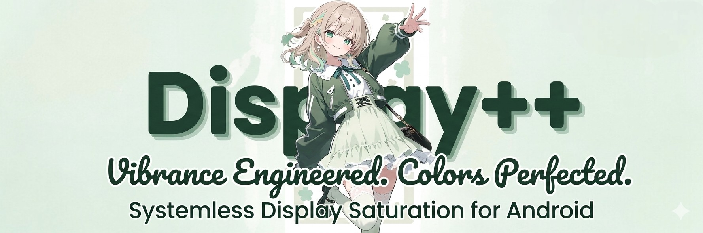
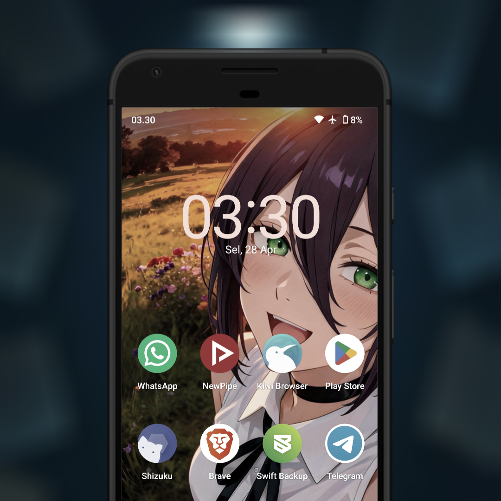
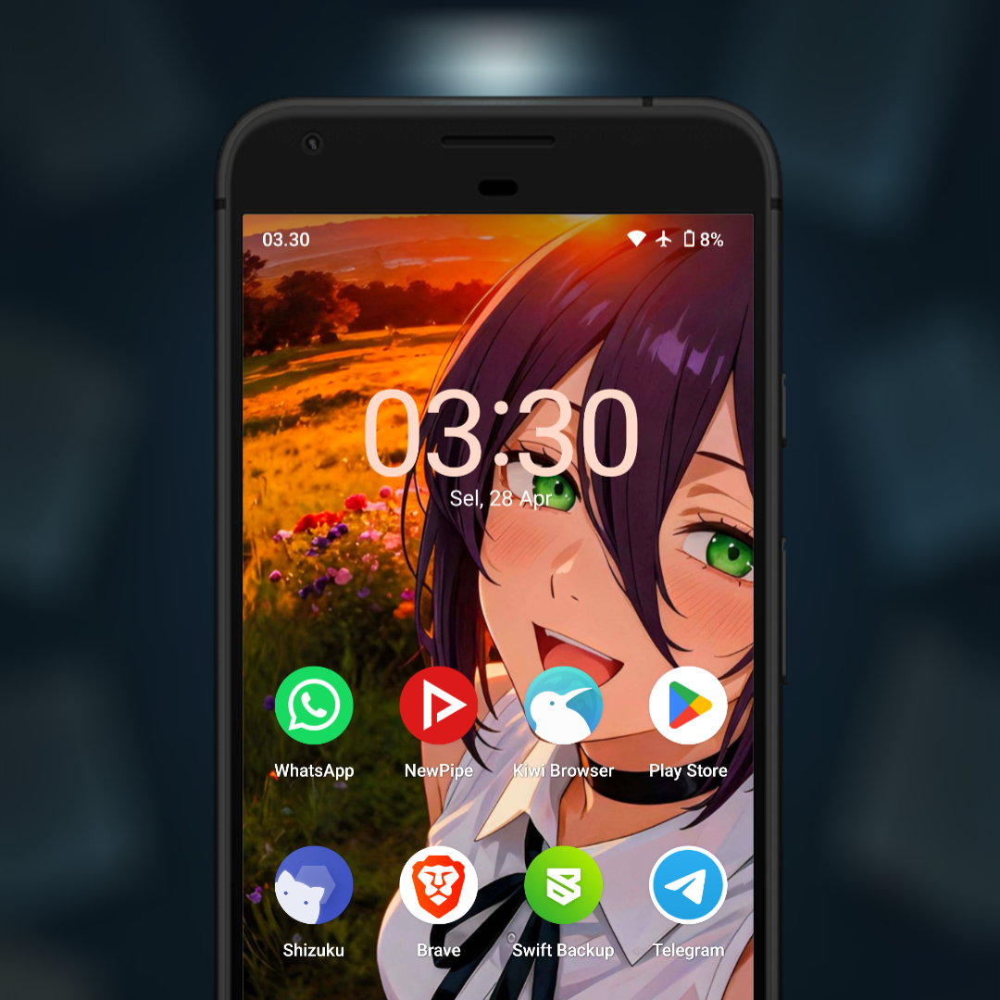
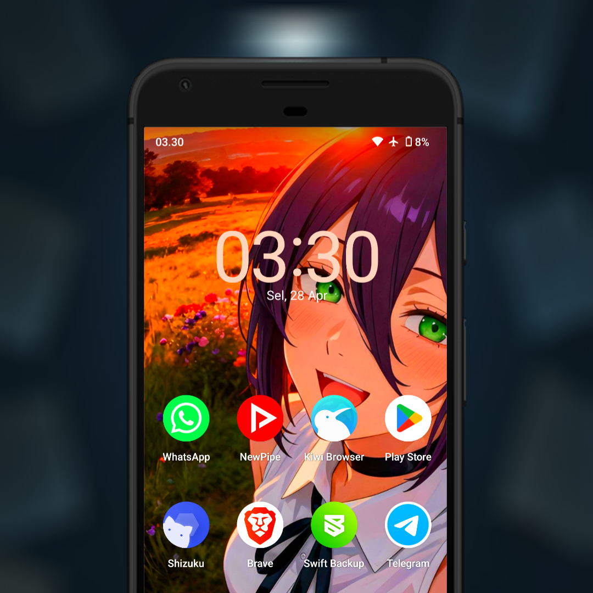

# Display++

## Project Overview
**Display++** is a universal systemless module designed to enhance your visual experience by optimizing display saturation levels. Utilizing advanced SurfaceFlinger calls, this module provides a more vibrant and punchy color profile across all UI elements and applications.

### Key Features
- **Universal Compatibility:** Works on all Android versions and device manufacturers.
- **ROM Agnostic:** Supports both Stock and Custom ROMs.
- **Efficient Performance:** Lightweight script execution with minimal battery impact.
- **Systemless:** Safe installation via Magisk, KernelSU, or APatch.

---

## Visual Comparison

To understand the impact of **Display++**, refer to the 1:1 scale comparisons below:

  <h3>Original / Without Module</h3>
  
  
<i>Default system saturation levels.</i>

  
   

  <h3>With Display++ (1.5x)</h3>
  
  
<i>Moderate enhancement for more vivid colors while maintaining natural tones.</i>

   

  <h3>With Display++ (2.0x)</h3>
  
  
<i>Maximum vibrancy for a high-contrast, punchy visual experience.</i>

---

## Installation & Removal
1. **Installation:** Flash the module via your preferred root manager (Magisk/KernelSU/APatch).
2. **Reboot:** A device restart is required to initialize the SurfaceFlinger service call.
3. **Uninstallation:** Simply remove the module from your manager and reboot to restore default display values.

---

## Join Our Community
Stay updated with the latest releases, technical support, and community discussions:

---
